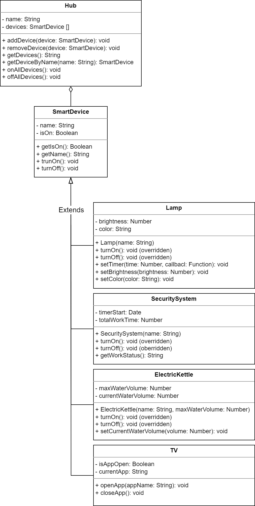

# Проект Розумний Будинок

## 1. Ідея проєкту та UML-діаграма

### Сутності:
- **Hub:** Керує підключеними пристроями.
- **SmartDevice:** Базовий клас для всіх розумних пристроїв.
- **Lamp:** Наслідується від SmartDevice, керує яскравістю та кольором.
- **SecuritySystem:** Наслідується від SmartDevice, контролює стан безпеки.
- **ElectricKettle:** Наслідується від SmartDevice, кип'ятильник.
- **TV:** Наслідується від SmartDevice, управління телевізором.

### UML-діаграма:

## 2. Основні Положення, Вивчені під час Курсу

Весь проєкт був реалізований з використанням EcmaScript 5 згідно з вимогами курсу. Ключові концепції включають:
- Прототипне наслідування.
- Прототипна реалізація методів.
- Встановлення конструктора через прототип після наслідування класів.

## 3. Демонстрація

Проєкт включає різноманітні розумні пристрої, такі як лампи, система безпеки, електрочайники та телевізор. Їх можна включати/виключати, налаштовувати та взаємодіяти з ними через центральний хаб.

## 4. Інкапсуляція

Приватні змінні позначені подвійними підкресленнями (`__`) перед іменем змінної, що гарантує інкапсуляцію.

## 5. Наслідування

Використовується прототипне наслідування для створення спеціалізованих розумних пристроїв (Lamp, SecuritySystem, ElectricKettle, TV), які успадковуються від базового класу SmartDevice.

## 6. Взаємозв'язки

Використовується агрегація, з SmartDevices, які агрегуються хабом. Кожен SmartDevice зберігає свою незалежність.

## 7. Поліморфізм

Методи `turnOn` та `turnOff` перевизначені в деяких похідних класах для демонстрації поліморфічної поведінки.

## 8. Асинхронний Метод

Проєкт демонструє асинхронний метод з використанням зворотного виклику (`setTimer`) для лампи, що симулює виконання за розкладом.

## 9. Додаткові Пункти

- Проєкт акцентується на читабельності коду та його підтримці.
- Обробка помилок та журналювання вбудовані в різні методи.
- Код містить приклади використання, які демонструють функціональність різних розумних пристроїв.